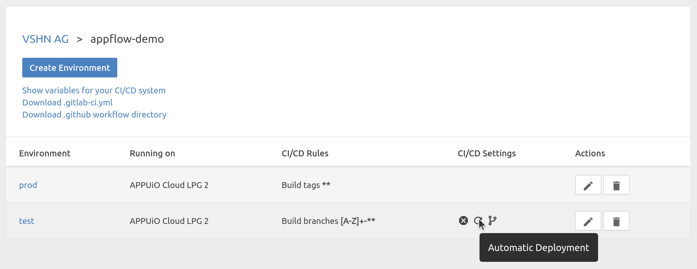
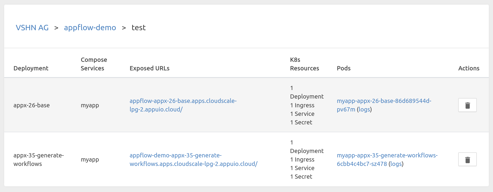

# appflow-demo

## What is this repository about?

This repository serves as an AppFlow showcase. It contains a basic introduction and also a live, working AppFlow setup for you to look at.

## What is AppFlow?

AppFlow is a set of tools helping developers deploy their applications to Kubernetes.

## Why does it exist?

Successfully running applications on Kubernetes requires a lot of tooling and setup, which is pretty arduous for developers with Kubernetes experience and almost impossible for everybody else.

At the same time developers have to re-invent the wheel a lot when it comes to creating build pipelines and Kubernetes deployments.

We think there should be easy-to-use tools that can cover the common use cases.

## What are the design principles?

* Standardized setup following best practices while still supporting most use cases
* Do not try support *every* potential use case (sorry) to keep complexity at bay
* Usable by developers with minimal Kubernetes experience
* Minimal requirements on the Kubernetes target cluster (no need to install operators, special configuration, ...)
* Processes are observable by the developers (no intransparent build systems, webhooks, ...)
* Based on tools the developer is likely to already know

## Which tools does it use?

AppFlow uses:

* [Dockerfile](https://docs.docker.com/engine/reference/builder/)s for building and packaging applications
* [Compose](https://docs.docker.com/compose/compose-file/) (aka "Docker Compose") to describe an application deployment with its dependencies
* [k8ify](https://github.com/vshn/k8ify) to convert Compose files into Kubernetes manifests (aka "Heap of YAML that makes your application work on Kubernetes")
* CI/CI pipelines for testing/building and to trigger deployments ([GitLab](https://gitlab.com) and [GitHub](https://github.com) are supported, but others would work too)
* GitLab/GitHub secrets that get injected into the deployments
* One or multiple existing Kubernetes clusters as deployment targets (AppFlow does *not* help you with running Kubernetes in any way)
* A web UI to help you set up Kubernetes namespaces, access tokens, GitLab/GitHub pipelines. For now this is [VSHN](https://www.vshn.net) specific and not public.

## I want to see it!

* Dockerfiles need to be written by the developer as they are specific to each application. [Our Dockerfile](https://github.com/vshn/appflow-demo/blob/master/Dockerfile) is extremely simple and just builds an nginx container that delivers a static site.
* Compose files also need to be written by the developer, as they describe how the application needs to be deployed and which external systems (e.g. databases) are needed. There is one [compose base file](https://github.com/vshn/appflow-demo/blob/master/docker-compose.yml) and one for each environment, which overwrites or extends the base file; in our case for [test](https://github.com/vshn/appflow-demo/blob/master/docker-compose-test.yml) and [prod](https://github.com/vshn/appflow-demo/blob/master/docker-compose-prod.yml)
* [k8ify](https://github.com/vshn/k8ify) would normally only run in a CI/CD pipeline. However if you have the `k8ify` binary available you can invoke it via the `k8ify-demo.sh` script, and it will generate manifests into the `manifests` directory. If you don't have it available you can look at the sample output in the [manifests-demo](https://github.com/vshn/appflow-demo/blob/master/manifests-demo) directory. The generated manifests would normally not be checked in to the repository, they would only exist in the context of a running CI/CD pipeline.
* [.k8ify.defaults.yaml](https://github.com/vshn/appflow-demo/blob/master/.k8ify.defaults.yaml) contains some configuration for k8ify which is specific to the target cluster. This particular configuration will cause `k8ify` to add an annotation to make Let's Encrypt certificates work.
* A GitHub pipeline is available in [.github](https://github.com/vshn/appflow-demo/blob/master/.github)
* This repository has two environments set up ('test' and 'prod'). The 'test' environment contains the secrets `KUBECONFIG_TEST` and `ADMIN_PW`, and the 'prod' environment contains `KUBECONFIG_PROD` and also `ADMIN_PW`. Sorry you'll have to trust us on this because they're, well, secrets.
* We use [APPUiO Cloud](https://appuio.cloud) as a deployment target, which is based on OpenShift (a Kubernetes flavor), but any Kubernetes cluster should do, provided that it is reachable from wherever the CI/CD pipeline runs. You can test the running application here (prod): [appflow.demo.vshn.net](https://appflow.demo.vshn.net/). The test instances are public as well, but their URLs can change.
* Web UI, overview over all environments: 
* Web UI, overview over deployed branches in `test` environment: 
